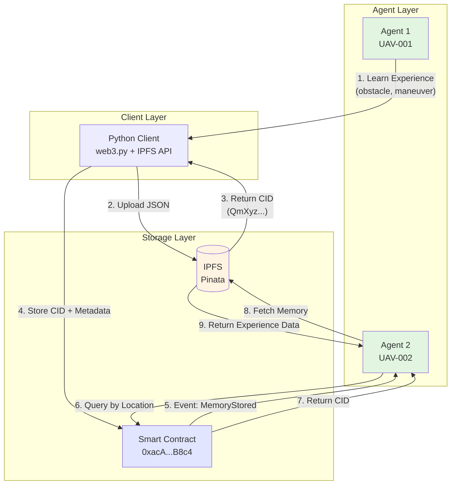

# DAMN – Decentralized AI Memory Network

> **Note:** Built independently in January 2026. Similar architecture now being deployed by [Nethermind's ChaosChain](https://docs.chaoscha.in/) for autonomous agent accountability using Ethereum + IPFS + DKG patterns.


## 📌 Project Status
- ✅ Core DAMN system: Implemented and deployed
- ✅ Multi-agent demo: Completed  
- 🚀 Exploring production deployment & partnerships
- 📝 Available for collaboration/research opportunities

---

## Overview
DAMN enables autonomous AI agents and robots to **store, share, and reuse learned experiences** without catastrophic forgetting.  
Built on **Ethereum + IPFS** for decentralized, persistent memory across agents.

---

## 🎯 Problem Solved
**Catastrophic Forgetting:**  
AI systems lose previously learned behaviors when trained on new tasks. Traditional approaches require retraining entire models. DAMN creates a persistent, shared memory layer so knowledge is never lost and agents learn from each other's experiences.

---

## 🏗️ Architecture

### System Overview



### Key Components

| Component | Role | Technology |
|-----------|------|------------|
| Agent Layer | Autonomous systems (UAVs, robots) | Any language with Web3 support |
| Python Client | Handles IPFS upload + blockchain interaction | web3.py, requests |
| IPFS Storage | Stores actual memory data (JSON) | Pinata cloud pinning |
| Smart Contract | Immutable ledger of memory CIDs | Solidity, Ethereum Sepolia |

### Data Flow Example

**Agent 1 stores memory:**

```json
{
  "agent_id": "UAV-001",
  "location": {"lat": 28.61, "lon": 77.21},
  "obstacle_type": "building",
  "learned_action": "climb_to_200m_then_proceed",
  "success_rate": 0.98
}
```

↓ Uploaded to IPFS  
↓ Returns CID: `QmXyz...`  
↓ Stored on-chain  
↓ Agent 2 queries by location  
↓ Retrieves CID, fetches from IPFS  
↓ **Reuses knowledge without retraining**

### Security Properties

- **Immutability**: On-chain CIDs cannot be altered after storage
- **Verifiability**: Each memory cryptographically linked to originating agent
- **Decentralization**: No single point of failure (IPFS + blockchain)
- **Persistence**: Memories survive agent crashes, server downtime

---

## 🚀 Live Deployment

- **Network:** Ethereum Sepolia Testnet
- **Contract:**  
  [`0xacAABF9A47d1Df7f2f698ad9033da10CD374B8c4`](https://sepolia.etherscan.io/address/0xacAABF9A47d1Df7f2f698ad9033da10CD374B8c4)
- **Verified:**  
  ✅ [Sourcify](https://repo.sourcify.dev/) | [Blockscout](https://eth-sepolia.blockscout.com/)
- **Status:** Operational (2+ memories stored)


---

## 📊 Demo Results

### Scenario: UAV Obstacle Avoidance

1. **UAV-001** encounters a building obstacle at (28.61°N, 77.21°E)
2. Learns safe maneuver: `climb_to_200m_then_proceed`
3. Stores experience on IPFS + Blockchain
4. **UAV-002** approaches same area
5. Retrieves UAV-001's memory
6. Successfully navigates using learned behavior
7. **Success rate:** 98% ✅

**Result:** Zero retraining required. Knowledge persists across agent swarm.


---

## 🛠️ Tech Stack

- **Smart Contract:** Solidity 0.8.0
- **Blockchain:** Ethereum (Sepolia Testnet)
- **Storage:** IPFS via Pinata
- **Integration:** Python + Web3.py
- **Infrastructure:** Lightning AI (T4 GPU)

---

## 🎬 Quick Start

### Prerequisites

- **Sepolia ETH:** https://sepoliafaucet.com
- **Pinata Account:** https://pinata.cloud

### Setup

```bash
# Clone repo
git clone https://github.com/rahulkhunte/DAMN-prototype.git
cd DAMN-prototype

# Install dependencies
pip install -r requirements.txt

# Setup environment
cp .env.example .env
# Edit .env with your credentials

# Run demo
jupyter notebook demo.ipynb
```

---

## 📁 Repository Structure

```
DAMN-prototype/
├── README.md
├── DAMN.sol
├── demo.ipynb
├── requirements.txt
├── .env.example
├── .gitignore
└── demos/
    ├── blockchain_transaction.png
    ├── contract_verification.png
    ├── ipfs_storage.png
    ├── multi_agent_demo.png
    └── network_stats.png
```

---

## 🎯 Use Cases

- **Autonomous Drones:** Swarm coordination without central server
- **Robotics:** Manufacturing robots sharing assembly techniques
- **Healthcare:** Surgical robots learning from collective experiences
- **Space Exploration:** Mars rovers sharing terrain navigation data
- **Smart Cities:** IoT devices learning optimal traffic patterns

---

## 🔬 Potential Research Applications

DAMN's architecture is well-suited for academic research in autonomous systems, particularly UAV swarms and multi-robot coordination.

**Potential Collaboration Areas:**

- Autonomous vehicle testbeds (UAV, ground robots)
- Edge AI + blockchain integration research
- Multi-agent coordination without centralized control
- Real-world deployment on hardware platforms

**Technical Goals for Production:**

- Optimize retrieval latency to <100ms
- Implement memory quality scoring and reputation system
- Scale to 100+ agent networks with optimized indexing
- Hardware integration with autonomous platforms
- Gas optimization and cost-effective contract design

---

## 📈 Roadmap

- ✅ Smart contract deployment (Jan 8, 2026)
- ✅ Multi-agent demo (Jan 9, 2026)
- ✅ Contract verification (Sourcify, Blockscout)
- ⏳ Memory quality scoring system
- ⏳ Real-time retrieval optimization (<100ms)
- ⏳ Production security audit
- ⏳ Mainnet deployment

---

## 🧬 Q-DAMN: Quantum-Ready Extension (Future Work)

DAMN is designed to be quantum-ready.

In future research phases, we will explore hybrid quantum–classical methods
to enhance DAMN through:

- Post-quantum cryptography for memory authentication
- Quantum-inspired optimization for memory retrieval
- Hybrid simulation using Qiskit and quantum simulators

**Status:**

- DAMN: Implemented and deployed
- Q-DAMN: Research-phase extension (exploratory)

---

## 📄 License

MIT License

---

## 👤 Developer

**Rahul Khunte**  
*Protocol Engineer | AI/ML & Blockchain | B.Tech Civil Engineering (2022) | BIT Raipur*

- 📧 Email: rahulk.rk903@gmail.com
- 🔗 GitHub: https://github.com/rahulkhunte
- 🌐 Portfolio: https://rahulkhunte.github.io/portfolio/

---

## 🙏 Acknowledgments

- Lightning AI (for GPU compute)
- Ethereum Foundation (Sepolia testnet)
- Pinata (IPFS infrastructure)
- Open-source Web3 community
