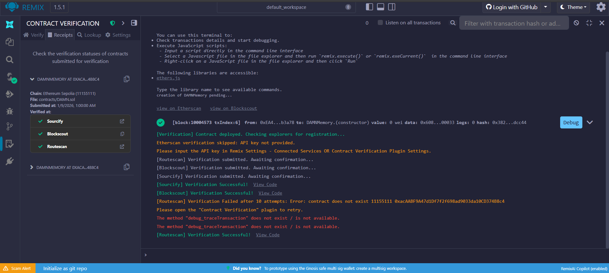
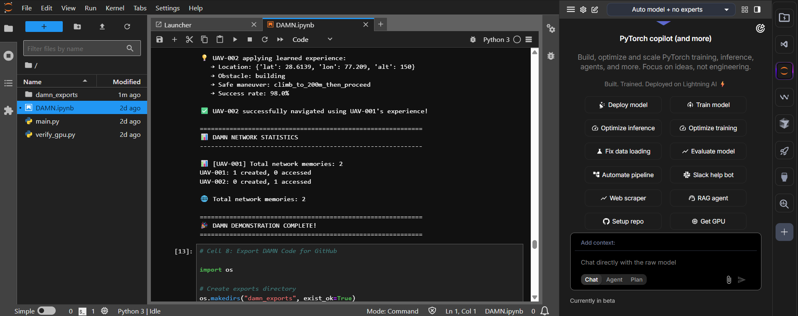
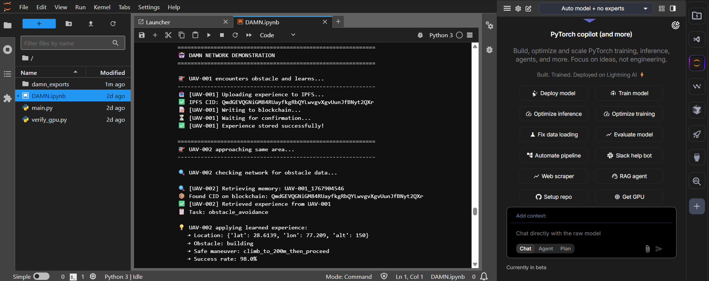

# DAMN - Decentralized AI Memory Network



## Overview
DAMN enables autonomous AI agents and robots to **store, share, and reuse learned experiences** without catastrophic forgetting. Built on Ethereum + IPFS for true decentralization.

## 🎯 Problem Solved
**Catastrophic Forgetting:** AI systems lose previously learned behaviors when trained on new tasks. DAMN creates a persistent, shared memory layer across all agents.

## 🏗️ Architecture
- **IPFS:** Decentralized storage for memory data
- **Ethereum:** Immutable ledger storing IPFS hashes  
- **Smart Contract:** Access control and ownership tracking

## 🚀 Live Deployment
- **Network:** Ethereum Sepolia Testnet
- **Contract:** [`0xacAABF9A47d1Df7f2f698ad9033da10CD374B8c4`](https://sepolia.etherscan.io/address/0xacAABF9A47d1Df7f2f698ad9033da10CD374B8c4)
- **Verified:** ✅ [Sourcify](https://repo.sourcify.dev/) | [Blockscout](https://eth-sepolia.blockscout.com/)
- **Status:** Operational (2+ memories stored)



## 📊 Demo Results
### Scenario: UAV Obstacle Avoidance
1. **UAV-001** encounters building obstacle at coordinates (28.61°N, 77.21°E)
2. Learns safe maneuver: `climb_to_200m_then_proceed`
3. Stores experience on IPFS + Blockchain
4. **UAV-002** approaches same area
5. Retrieves UAV-001's memory from network
6. Successfully navigates using learned behavior
7. **Success rate:** 98% ✅

**Result:** Zero retraining required. Knowledge persists across agent swarm.



## 🛠️ Tech Stack
- **Smart Contract:** Solidity 0.8.0
- **Blockchain:** Ethereum (Sepolia Testnet)
- **Storage:** IPFS via Pinata
- **Integration:** Python + Web3.py
- **Infrastructure:** Lightning AI (T4 GPU)

## 🎬 Quick Start

### Prerequisites
- **Sepolia ETH:** Get free testnet tokens from [sepoliafaucet.com](https://sepoliafaucet.com)
- **Pinata Account:** Sign up for free at [pinata.cloud](https://pinata.cloud)

### Setup
```bash
# Clone repo
git clone https://github.com/rahulkhunte/DAMN-prototype.git
cd DAMN-prototype

# Install dependencies
pip install -r requirements.txt

# Setup environment
cp .env.example .env
# Edit .env with your credentials

# Run demo
jupyter notebook demo.ipynb
##📁 Repository Structure
text
DAMN-prototype/
├── README.md              # This file
├── DAMN.sol               # Smart contract source
├── demo.ipynb             # Jupyter notebook demo
├── requirements.txt       # Python dependencies
├── .env.example           # Environment template
├── .gitignore            # Git ignore rules
└── demos/                 # Screenshots
    ├── blockchain_transaction.png
    ├── contract_verification.png
    ├── ipfs_storage.png
    ├── multi_agent_demo.png
    └── network_stats.png
🎯 Use Cases
Autonomous Drones: Swarm coordination without central server

Robotics: Manufacturing robots sharing assembly techniques

Healthcare: Surgical robots learning from collective experiences

Space Exploration: Mars rovers sharing terrain navigation data

Smart Cities: IoT devices learning optimal traffic patterns

🔬 TiHAN IIT Hyderabad R&D Proposal
This project is submitted to TiHAN - IIT Hyderabad for R&D funding under autonomous systems research.

Proposed Goals:

Optimize retrieval latency for real-time systems (<100ms)

Implement memory quality scoring (trustworthiness metrics)

Scale to 100+ agent networks

Deploy on TiHAN UAV testbed

📈 Roadmap
 Smart contract deployment (Jan 8, 2026)

 Multi-agent demo (Jan 9, 2026)

 Contract verification (Sourcify, Blockscout, Routescan)

 Memory quality scoring system

 Real-time retrieval optimization

 Hardware UAV integration (TiHAN testbed)

 Mainnet deployment

📄 License
MIT License

👤 Developer
Rahul Khunte
AI/ML & Blockchain Developer | B.Tech Civil Engineering (2022) | BIT Raipur

📧 rahulk.rk903@gmail.com
🔗 Portfolio | GitHub

🙏 Acknowledgments
TiHAN - IIT Hyderabad (for research opportunity)

Lightning AI (for GPU compute)

Ethereum Foundation (Sepolia testnet)

Pinata (IPFS infrastructure)

Built for TiHAN IIT Hyderabad R&D Proposal | January 2026
