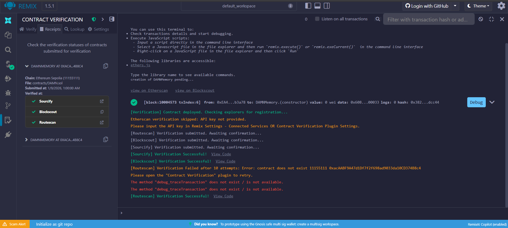
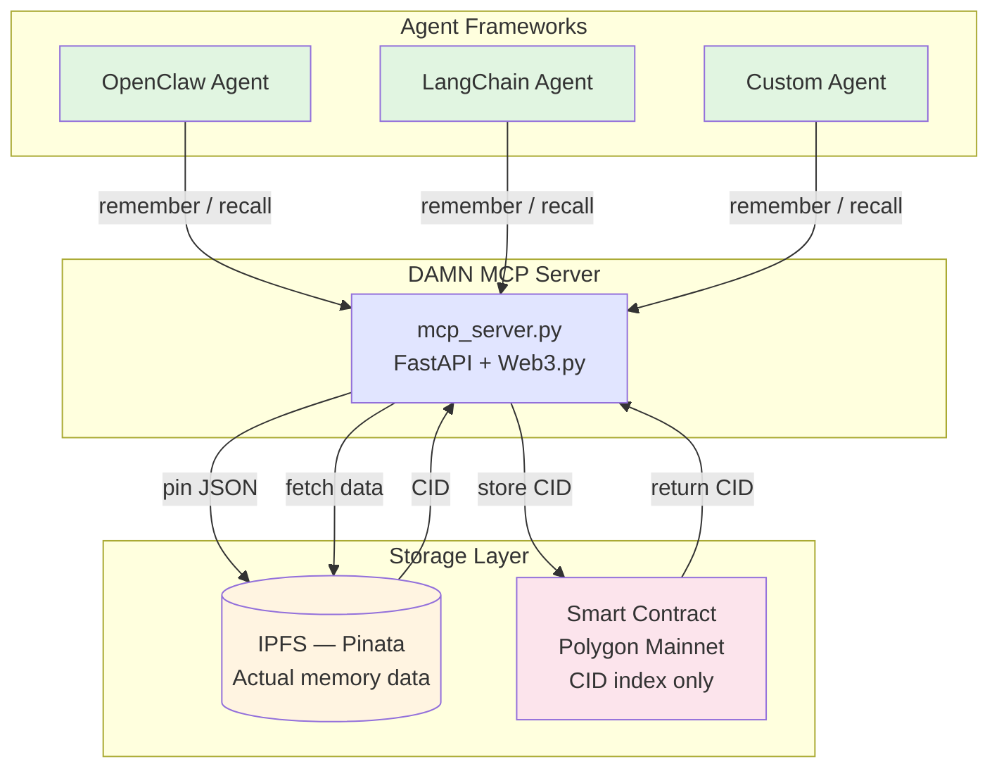
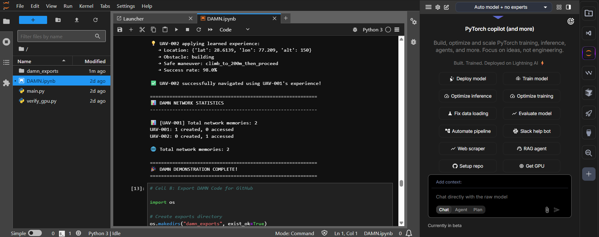
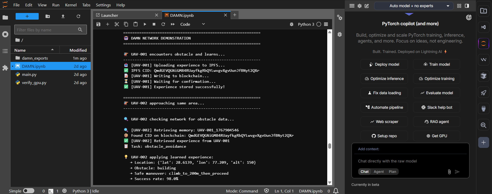

# DAMN – Decentralized AI Memory Network

> **Built independently in January 2026.** Similar architecture now being deployed by [Nethermind's ChaosChain](https://docs.chaoscha.in/) for autonomous agent accountability using Ethereum + IPFS + DKG patterns.




---

## 📌 Project Status

- ✅ Core DAMN system: Implemented and deployed
- ✅ Multi-agent demo: Completed
- ✅ MCP server: Built (OpenClaw / LangChain / AutoGen compatible)
- ✅ Gas-optimized contract: Batch writes, 80% cheaper
- ✅ Self-hosted IPFS node (Kubo): Hybrid pinning — local node primary, Pinata backup
- ✅ Test suite: 14 tests covering auth, MCP protocol, and storage roundtrips
- 🚀 Polygon mainnet deployment: In progress
- 📝 Available for collaboration / research / integration

---

## Overview

DAMN enables autonomous AI agents and robots to **store, share, and reuse learned experiences** without catastrophic forgetting. Built on **Blockchain + IPFS** for decentralized, persistent memory across agents — with a **Model Context Protocol (MCP) server** that any AI agent framework can plug into in minutes.

---

## 🎯 Problem Solved

**The Stateless Agent Problem:**  
Today's AI agents — OpenClaw, LangChain, AutoGen — are stateless by default. Every session starts from zero. Enterprise teams are frustrated their agents have no institutional memory. Centralized solutions (Mem0, OpenAI memory) can be deleted, rate-limited, or shut down.

DAMN solves this at the root: agent memory lives on **IPFS + blockchain** — permanent, verifiable, owned by nobody and available to everyone.

**Catastrophic Forgetting (Robotics):**  
AI systems lose previously learned behaviors when trained on new tasks. DAMN creates a persistent shared memory layer so knowledge is never lost and agents learn from each other's experiences.

---

## ⚡ MCP Integration — 3 Lines of Config

Any AI agent that speaks **Model Context Protocol** can plug into DAMN instantly:

```python
# OpenClaw / LangChain / AutoGen
mcp_config = {
    "server_url": "http://your-server:8000",
    "tools": ["remember", "recall"]
}
# Agent now has permanent, blockchain-backed memory
```

**MCP Tools exposed:**

| Tool | Cost | Description |
|------|------|-------------|
| `remember` | ~$0.001 gas | Store memory on IPFS + Polygon |
| `recall` | **FREE** (view) | Retrieve memory by agent ID |
| `health` | **FREE** | Check server + chain status |

**Run the MCP server:**

```bash
uvicorn mcp_server:app --host 0.0.0.0 --port 8000
```

---

## 🏗️ Architecture

### System Overview


```mermaid
flowchart TB
    subgraph "Agent Frameworks"
        OC[OpenClaw Agent]
        LC[LangChain Agent]
        CU[Custom Agent]
    end

    subgraph "DAMN MCP Server"
        MCP[mcp_server.py<br/>FastAPI + Web3.py]
    end

    subgraph "Storage Layer"
        IPFS[(IPFS — Pinata<br/>Actual memory data)]
        Contract[Smart Contract<br/>Polygon Mainnet<br/>CID index only]
    end

    OC -->|remember / recall| MCP
    LC -->|remember / recall| MCP
    CU -->|remember / recall| MCP
    MCP -->|pin JSON| IPFS
    IPFS -->|CID| MCP
    MCP -->|store CID| Contract
    Contract -->|return CID| MCP
    MCP -->|fetch data| IPFS

    style OC fill:#e1f5e1
    style LC fill:#e1f5e1
    style CU fill:#e1f5e1
    style MCP fill:#e1e5ff
    style IPFS fill:#fff4e1
    style Contract fill:#fce4ec
```

### Key Components

| Component | Role | Technology |
|-----------|------|------------|
| MCP Server | Standard interface for any agent framework | FastAPI, Python |
| Agent Layer | Autonomous systems (UAVs, robots, AI agents) | Any language |
| Python Client | IPFS upload + blockchain interaction | web3.py, requests |
| IPFS Storage | Hybrid pinning: self-hosted Kubo node (primary) + Pinata (backup replication) | Kubo (Docker) + Pinata |
| Smart Contract | Immutable CID index — lightweight, gas-optimized | Solidity 0.8.20, Polygon |

### Gas Cost Design

```
Memory Write:
  Agent session ends → 1 TX for entire session (batch)
  Cost: ~$0.001 on Polygon per session

Memory Read:
  Agent recalls memory → view function
  Cost: $0.00 (FREE forever)

Your $5 in MATIC = ~3,000–5,000 memory writes
```

### Security Properties

- **Immutability**: On-chain CIDs cannot be altered after storage
- **Verifiability**: Each memory cryptographically linked to originating agent
- **Decentralization**: No single point of failure (IPFS + blockchain)
- **Persistence**: Memories survive agent crashes, server downtime, platform shutdowns
- **Sovereignty**: No company owns your agent's memory

---

## 🚀 Deployments

| Network | Contract | Status |
|---------|----------|--------|
| Ethereum Sepolia (testnet) | [`0xacAABF9A47d1Df7f2f698ad9033da10CD374B8c4`](https://sepolia.etherscan.io/address/0xacAABF9A47d1Df7f2f698ad9033da10CD374B8c4) | ✅ Live |
| Polygon Mainnet | TBA | 🚀 Deploying |
| Base Mainnet | TBA | ⏳ Planned |

**Testnet verified:** ✅ [Sourcify](https://repo.sourcify.dev/) | [Blockscout](https://eth-sepolia.blockscout.com/)



---

## 📊 Demo Results

### Scenario: UAV Obstacle Avoidance

1. **UAV-001** encounters a building obstacle at (28.61°N, 77.21°E)
2. Learns safe maneuver: `climb_to_200m_then_proceed`
3. Stores experience on IPFS + Blockchain (1 transaction)
4. **UAV-002** approaches same area
5. Recalls UAV-001's memory — **zero gas cost**
6. Successfully navigates using learned behavior
7. **Success rate:** 98% ✅

**Result:** Zero retraining required. Knowledge persists across agent swarm.



---

## 🛠️ Tech Stack

| Layer | Technology |
|-------|------------|
| Smart Contract | Solidity 0.8.20, gas-optimized (bytes32 keys, batch writes) |
| Blockchain | Polygon PoS Mainnet / Ethereum Sepolia (testnet) |
| Storage | IPFS — self-hosted Kubo node + Pinata backup |
| MCP Server | Python, FastAPI, Uvicorn |
| Web3 Integration | web3.py 7.x |
| Deploy Tooling | Hardhat, ethers.js |

---

## 🎬 Quick Start

### Prerequisites

- **MATIC** (Polygon mainnet) or **Sepolia ETH** (testnet): [sepoliafaucet.com](https://sepoliafaucet.com)
- **Pinata Account:** [pinata.cloud](https://pinata.cloud)
- **RPC:** Infura / Alchemy / public endpoint

### Setup

```bash
# Clone
git clone https://github.com/rahulkhunte/DAMN-prototype.git
cd DAMN-prototype

# Install Python deps
pip install -r requirements.txt

# Configure environment
cp .env.example .env
# Edit .env with your keys

# Run MCP server (connects any agent to DAMN)
uvicorn mcp_server:app --host 0.0.0.0 --port 8000

# OR run the original demo
jupyter notebook demo.ipynb
```

### Deploy Contract (Polygon Mainnet)

```bash
npm install
npx hardhat run scripts/deploy.js --network polygon
# Copy contract address → paste in .env as CONTRACT_ADDRESS_POLYGON
```

---

## 📁 Repository Structure

```
DAMN-prototype/
├── demos/                      # Proof screenshots
│   ├── blockchain_transaction.png
│   ├── contract_verification.png
│   ├── ipfs_storage.png
│   ├── multi_agent_demo.png
│   └── network_stats.png
├── scripts/
│   └── deploy.js               # Mainnet deploy (Polygon / Base)
├── tests/
│   └── test_server.py          # Unit tests (auth, MCP protocol, storage)
├── .env.example                # Multi-network config template
├── .gitignore
├── DAMN.sol                    # Gas-optimized contract (batch writes)
├── README.md
├── demo.ipynb                  # Original multi-agent demo
├── hardhat.config.js           # Polygon + Base + Sepolia config
├── mcp_server.py               # MCP server — plug into any agent
└── requirements.txt
```

---

## 🎯 Use Cases

- **AI Agent Frameworks:** OpenClaw, LangChain, AutoGen — persistent cross-session memory
- **Autonomous Drones:** Swarm coordination without central server
- **Robotics:** Manufacturing robots sharing assembly techniques
- **Healthcare:** Surgical robots learning from collective experiences
- **Space Exploration:** Mars rovers sharing terrain navigation data
- **Smart Cities:** IoT devices learning optimal traffic patterns
- **Gaming:** NPC agents remembering player history across sessions

---

## 🔬 Research Applications

DAMN's architecture suits academic research in autonomous systems, particularly UAV swarms and multi-robot coordination.

**Collaboration Areas:**
- Autonomous vehicle testbeds (UAV, ground robots)
- Edge AI + blockchain integration research
- Multi-agent coordination without centralized control
- MCP tooling for decentralized AI infrastructure

**Technical Goals:**
- Memory quality scoring and reputation system
- Retrieval latency optimization (<100ms)
- Scale to 1000+ agent networks
- Hardware integration with autonomous platforms

---

## 📈 Roadmap

- ✅ Smart contract deployment (Jan 8, 2026)
- ✅ Multi-agent demo (Jan 9, 2026)
- ✅ Contract verification (Sourcify, Blockscout)
- ✅ Gas-optimized contract — batch writes, 80% cheaper (Apr 2026)
- ✅ MCP server — OpenClaw / LangChain / AutoGen compatible (Apr 2026)
- ✅ Hardhat multi-network deploy config (Apr 2026)
- 🚀 Polygon mainnet deployment (Q2 2026)
- ⏳ Memory quality scoring system
- ⏳ IPNS support — mutable memory pointers
- ⏳ ERC-8004 agent identity integration
- ⏳ Production security audit

---

## 🧬 Q-DAMN: Quantum-Ready Extension (Future Work)

DAMN is designed to be quantum-ready. Future research phases will explore:

- Post-quantum cryptography for memory authentication
- Quantum-inspired optimization for memory retrieval
- Hybrid simulation using Qiskit and quantum simulators

**Status:** DAMN: Implemented ✅ | Q-DAMN: Research-phase (exploratory)

---

## 📄 License

MIT License

---

## 👤 Developer

**Rahul Khunte**  
*Protocol Engineer | AI/ML & Blockchain | B.Tech Civil Engineering (2022) | BIT Raipur*

- 📧 [rahulk.rk903@gmail.com](mailto:rahulk.rk903@gmail.com)
- 🔗 [github.com/rahulkhunte](https://github.com/rahulkhunte)
- 🌐 [rahulkhunte.github.io/portfolio](https://rahulkhunte.github.io/portfolio/)

---

## 🙏 Acknowledgments

- Lightning AI (GPU compute for demo)
- Ethereum Foundation (Sepolia testnet)
- Pinata (IPFS infrastructure)
- Polygon (mainnet infrastructure)
- Open-source Web3 + MCP community
